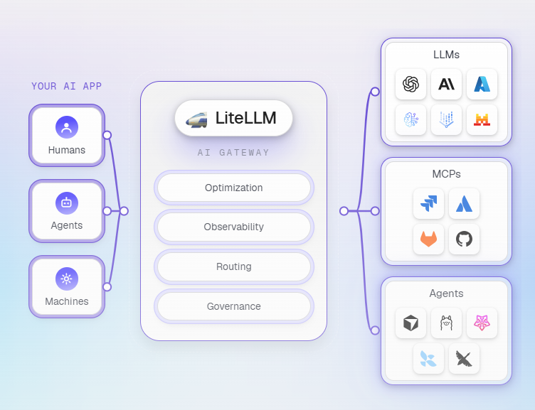

# LiteLLM

The AI Gateway for platform teams

LiteLLM is an open source AI Gateway that gives you a single, unified interface to call 100+ LLM providers — OpenAI, Anthropic, Gemini, Bedrock, Azure, and more — using the OpenAI format.

Use it as a Python SDK for direct library integration, or deploy the AI Gateway (Proxy Server) as a centralized service for your team or organization.

Official Website: `https://www.litellm.ai` and `https://github.com/BerriAI/litellm`


## Why LiteLLM
Managing LLM calls across providers gets complicated fast — different SDKs, auth patterns, request formats, and error types for every model. LiteLLM removes that friction:

Unified API — one interface for 100+ LLMs, no provider-specific SDK juggling
Drop-in OpenAI compatibility — swap providers without rewriting your code
Production-ready gateway — virtual keys, spend tracking, guardrails, load balancing, and an admin dashboard out of the box
8ms P95 latency at 1k RPS

## Features

1. Access: Give your whole company every model.
Put every model, agent, and MCP behind one API and one login. We handle key management and work with the secret manager you already run, so platform teams open access to the whole org without becoming the bottleneck, and developers build in minutes, not a procurement cycle.

2. Visibility & Control: See every request, and cap it before it runs.
See who and what is driving usage and spend, attribute every request for chargeback, and cap budgets before they run. Set budgets and rate limits per team; when they hit the cap, requests stop.

3. Cost optimization: Maximize the ROI of your AI.
Swap models without changing a line of code, and let Auto Routing send each request to the model that should handle it, so the budget you set goes further.

4. Ease of deployment: Go live in your stack in an afternoon
Self-host the same open-source gateway behind 240M+ Docker pulls, in your own cloud or fully air-gapped. Simple enough that it just works.

5. Sub-millisecond overhead. Read the benchmark.
The LiteLLM Rust AI Gateway is live. On our benchmarks it adds 0.66 ms at p99 — 3.5× lower overhead than the next AI gateway — measured with AI Gateway Bench, an open standard for benchmarking and comparing AI gateways. Run it yourself.

6. Your keys, your infra, your audit trail.
Security fixes, stable releases, and what we're working on next. All public. Don't take our word for it; read the changelog and the code.

## LiteLLM AI Gateway (Proxy) Deployment

LiteLLM ships as a ready-to-run gateway.

You start it with one command (or one click), then do everything else in your browser: connect providers, add models, create keys, and send test requests from the built-in Admin UI. No config files are required for this guide. By the end you will have LiteLLM running at `http://localhost:4000` with a model connected, a virtual key issued, and a request served through the gateway.


### Local Deployment:



1. Start LiteLLM
```ai
curl -sSLO https://docs.litellm.ai/docker-compose.yml
docker compose up -d
```

2. Log in to the Admin UI
This brings up the gateway on port 4000 and a Postgres database that stores your models, keys, and spend logs.
Open http://localhost:4000/ui. The username is admin and the password is your LITELLM_MASTER_KEY value.

3. Add your first model
Go to Models + Endpoints, open the Add Model tab, pick your provider and the models you want to expose, and paste your provider API key. LiteLLM ships with each provider's model catalog, so you select models rather than type them.

4. Send a test message
Go to Playground, select your model, and send a message. The request goes through the gateway to your provider, and the response comes back with latency and token counts:

5. Create a virtual key
Go to Virtual Keys, click + Create New Key, give it a name, and click Create Key:
Copy the key now; it is shown only once.

6. Call the gateway from your app
The gateway is OpenAI-compatible, so any OpenAI SDK works by pointing it at http://localhost:4000 with your virtual key.

```ai
from openai import OpenAI

client = OpenAI(
    base_url="http://localhost:4000",
    api_key="sk-<your-virtual-key>",
)

response = client.chat.completions.create(
    model="gpt-5.5",
    messages=[{"role": "user", "content": "Say hello in five words."}],
)
print(response.choices[0].message.content)
```
Expected response:

```ai
{
  "id": "chatcmpl-Xwdad56cff77bsdsadDH7jkklli",
  "model": "gpt-5.5",
  "object": "chat.completion",
  "choices": [
    {
      "finish_reason": "stop",
      "index": 0,
      "message": {
        "content": "Hello, nice to meet you.",
        "role": "assistant"
      }
    }
  ],
  "usage": {
    "completion_tokens": 70,
    "prompt_tokens": 12,
    "total_tokens": 82
  }
}
```