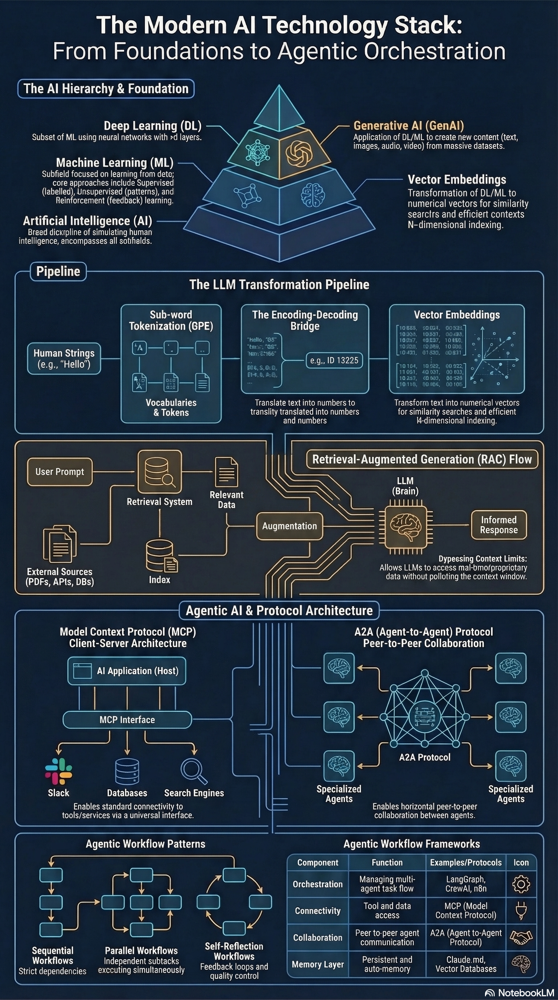

# 🧠 ai-engineering-stack

[](https://github.com/Vish-TechOps/ai-engineering-stack/commits/main)
[](https://github.com/Vish-TechOps/ai-engineering-stack/stargazers)


An AI-native engineering workspace for prototyping and shipping intelligent systems and workflows — from prototype to production at the speed of AI.

**AI – Brings Big Shift in the Engineering Space.** The world of Engineering is being Rewritten by AI.

**AI Technology Stack** - An AI stack is a collection of technologies, frameworks and infrastructure components that facilitate using artificial intelligence (AI) systems. It provides a structure for building AI solutions by layering these components to support the end-to-end AI lifecycle.



---

## 📂 Repository Structure

```
ai/
├── agents/       # Agent definitions and configurations
├── commands/     # Custom slash commands and reusable prompts
├── mcps/         # Model Context Protocol server integrations
├── skills/       # Reusable, composable capability modules
├── use-cases/    # Applied, real-world AI implementation examples
└── workflows/    # Multi-step and multi-agent orchestration patterns
```


Additional areas planned as the stack matures: `hooks/` (event-driven automation) and expanded `ai-use-cases/`.

## 🏗️ The AI Technology Stack

This repository is organized around the layers of a modern AI stack, moving from foundation to orchestration:

- **Foundation** — the AI → ML → DL → GenAI hierarchy, and vector embeddings as the bridge between human language and machine-searchable representations
- **LLM Pipeline** — tokenization, encoding/decoding, and embeddings that turn raw text into model-ready input
- **Retrieval-Augmented Generation (RAG)** — connecting LLMs to external and proprietary data without polluting the context window
- **Agentic AI & Protocol Architecture** — MCP (Model Context Protocol) for tool/data connectivity, and A2A (Agent-to-Agent) for peer-to-peer collaboration between specialized agents
- **Agentic Workflow Patterns** — sequential, parallel, and self-reflection workflows, orchestrated via frameworks like LangGraph, CrewAI, and n8n

## 🤝 Let's Build Together

This repository is a working, evolving reference — not a finished product. If you're building agents, MCP servers, or agentic workflows and want to compare notes, open an issue, fork it, or reach out directly. Let's collaborate and build this together!

## 👤 Author

**Vishvendra Singh** — AI Engineer • Technology Leader • Innovation • Strategy • Governance • Observability • DevOps • SRE • Cloud • Open-Source Contributor

[LinkedIn](https://www.linkedin.com/in/vishvendrasingh1) · [GitHub](https://github.com/Vish-TechOps)
